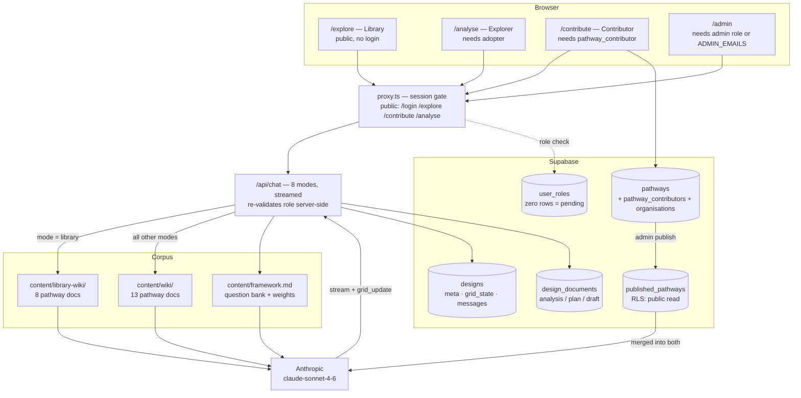
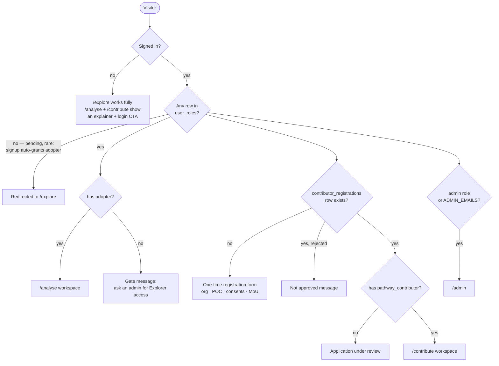
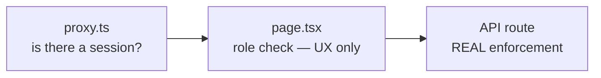
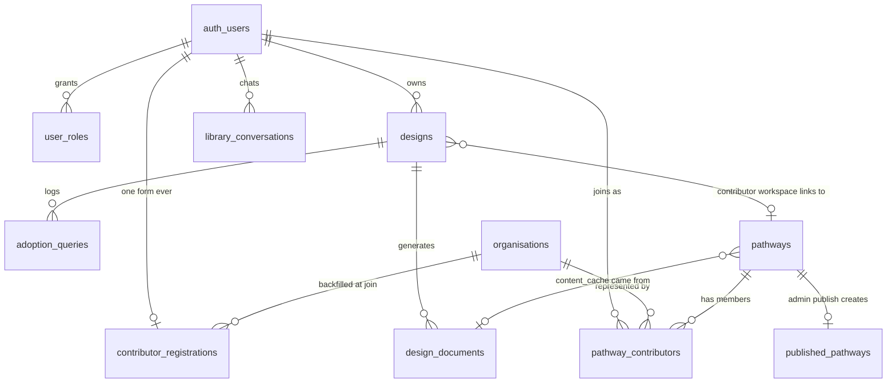
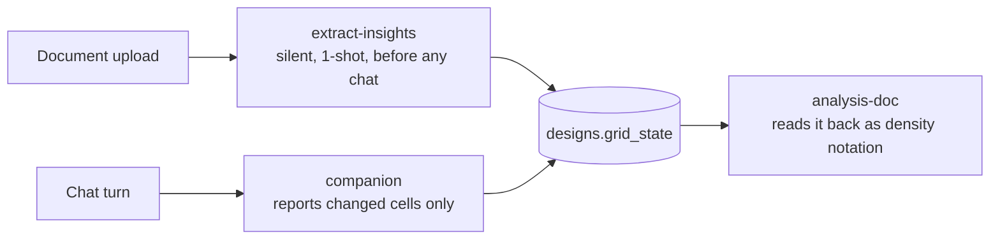
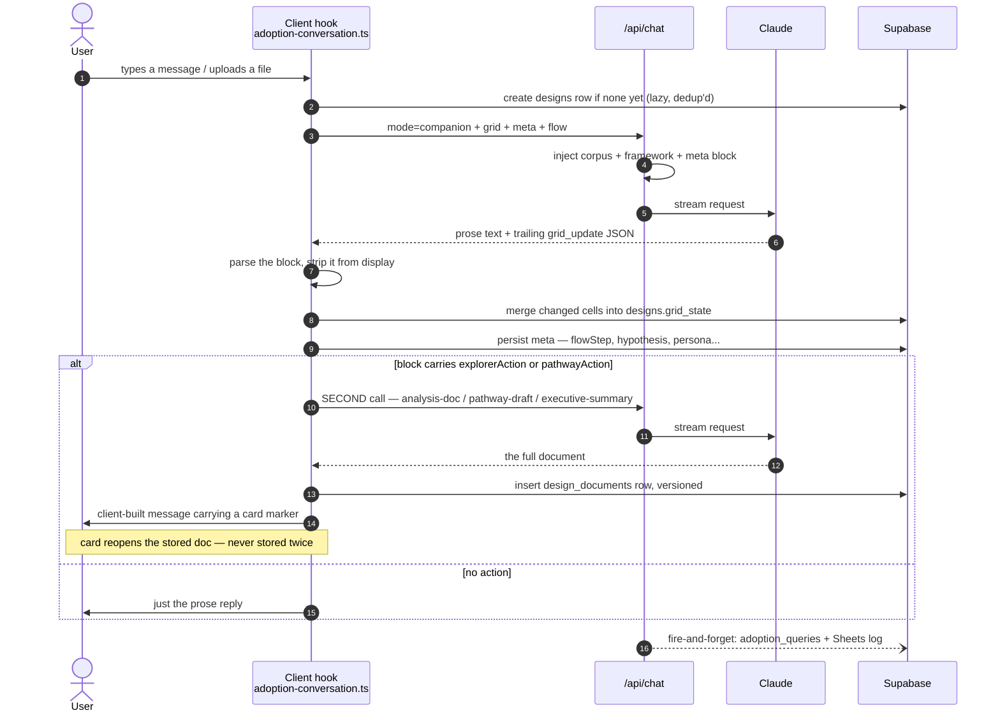
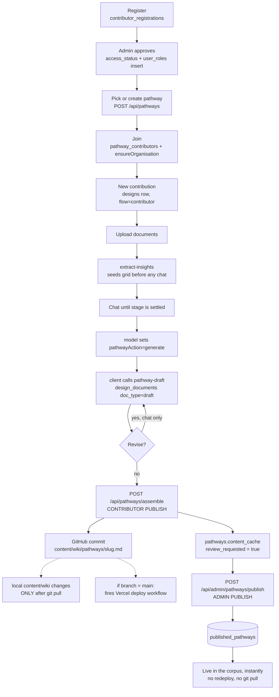

# 100 Pathways — how the app actually works

Written from the code as it stands, not from CLAUDE.md (which describes an
earlier architecture — the four-intent Explorer menu and the
`pathway_submissions` table are both gone).

---

## At a glance

Three surfaces, one chat route, two corpora. The thing to notice is that
`/explore` is grounded in **one document** while `/analyse` and `/contribute`
are grounded in the **whole corpus** — and that contributor-published content
reaches the corpus through the database, not through the files.



---

## 1. Glossary — every term, plainly

| Term | What it actually means |
| --- | --- |
| **Pathway** | One real AI deployment's documented journey — MahaVISTAAR, Blue Dots, etc. Exists in two forms: a markdown document (the corpus) and a `pathways` DB row (the workspace container contributors attach to). |
| **Corpus** | The whole body of pathway documents the model is grounded in. Part files-on-disk, part database. Two *separate* corpora exist — see §7. |
| **Adoption** / **design** | One user's conversation workspace. The UI says "adoption" or "conversation"; the table is `designs` (legacy name). Holds the chat history, the grid, and the metadata the model tracks. |
| **User** | A Supabase `auth.users` row. Access is decided entirely by `user_roles`. A new signup is auto-granted `adopter` right after sign-up ([grant-default-role](app/api/auth/grant-default-role/route.ts)), so "pending" only happens if that call fails. |
| **Role** | One of `adopter`, `pathway_contributor`, `admin`, `general_user`. A user can hold several. |
| **Explorer** (`adopter`) | Someone analysing *their own* AI adoption against the corpus. Entry point `/analyse`. |
| **Contributor** (`pathway_contributor`) | Someone turning *their own* deployment into a new corpus pathway. Entry point `/contribute`. |
| **Organisation** | A registry row (`organisations`) — the company/institution a contributor belongs to. Found-or-created by name at join time, shared across contributors. |
| **Grid** | A 4 dimensions × 4 stages matrix tracking how much is known about an adoption. Lives in `designs.grid_state`. |
| **Dimension** | One of four: **Persona**, **Solution**, **Institution**, **Ecosystem**. Each has lettered sub-categories (4/5/7/6). |
| **Stage** | One of four: **Explore → Define → Pilot → Scale**. Where a deployment is in its life. |
| **Density** | How well-covered a grid cell is. Rendered as status chips, not a table. |
| **Flow** | `'explorer'` or `'contributor'` — fixed on an adoption at creation, stored in `designs.meta.flow`. Decides which system prompt runs. |
| **Intent** | Historical. Was four Explorer modes; now collapses to a single `analyse` flow ([lib/explorer-intents.ts](lib/explorer-intents.ts)). Old stored values still resolve without crashing. |
| **flowStep** | Which numbered step of its script the model reports being on. Persisted in `meta` and re-injected every turn, because the `<grid_update>` block is stripped before storage. |
| **Design document** | A generated artifact stored in `design_documents`, one of three `doc_type`s: `analysis`, `plan` (exec summary), `draft` (pathway document). |
| **Contribution unit** | A tagged knowledge chunk (Strategic Decision, Tactical Decision, Failure and Fix, Playbook, Toolkit Asset) inside a pathway document. Table exists; **nothing writes it yet**. |
| **Micro-innovation** | A small practice borrowed from another adoption. Always framed as a *suggested choice*, never a recommendation. |
| **Provenance / Source Trace** | An appendix on each pathway doc recording where the material came from. **Contributor-only — stripped before anything adopter-facing.** |
| **Published pathway** | A `published_pathways` row — community content live in the corpus without a redeploy. |
| **Library** | `/explore`. A completely separate, public, no-login browsing + chat surface with its own corpus. |

---

## 2. The three products in one app

These barely share code beyond the chat route and the theme.

### `/explore` — the Library (public, no login)

Browse pathway cards, open one, chat with it. Grounded in **one document at a
time**, not the whole corpus.

- `mode: 'library'` is the only chat mode that skips the approval check
  ([route.ts:60](app/api/chat/route.ts#L60)).
- `proxy.ts` lists `/explore`, `/api/chat`, `/api/wiki-pathways` as public.
- Corpus: `content/library-wiki/pathways/` (8 files) with `published_pathways`
  as fallback ([route.ts:88-99](app/api/chat/route.ts#L88-L99)).
- Opening a pathway with empty history injects a fixed kickoff prompt — never
  shown as a chat bubble.
- Signed-in chats persist to `library_conversations`.

### `/analyse` — the Explorer flow (needs `adopter`)

The user describes or uploads their own project; the Cube compares it against
the corpus and says plainly what transfers and what doesn't.

Single 5-step script in [lib/explorer-intents.ts](lib/explorer-intents.ts):

1. Gather context silently (sector, problem, stage, role) — ask at most one question
2. Compare against the corpus immediately — exact match, adjacent match (mismatch stated), or "nothing transfers" said plainly
3. Name what matters next; mention the grid only if a cell actually changed
4. Keep going on what the user raises
5. Offer the write-up once there's real substance

**Upload override:** if documents arrive and sector + problem are both
derivable, the model sets `explorerAction: "analysis"` immediately and replies
with exactly two lines — no corpus comparison in prose, because the document
does that job.

### `/contribute` — the Contributor flow (needs `pathway_contributor` + approved registration)

Four steps in `contributorSystemPrompt` ([system-prompts.ts:358](lib/system-prompts.ts#L358)):

1. Wait for documents
2. Settle the stage — exactly one of: confirm an inferred stage, ask which fits, or say there's not enough and pause
3. The moment stage is settled, set `pathwayAction: "generate"` — the client calls `pathway-draft` itself, no button
4. Open loop: revise / publish / just talk

No judgment language about the shared material, positive or negative — which
is why this flow shares no step text with Explorer.

---

## 3. Access tiers — who can do what



Enforcement runs three deep, and only the last one counts:



**Signup auto-grants `adopter`.** `/analyse` therefore works immediately
after sign-up with no admin involvement. Only `pathway_contributor` and
`admin` are genuinely admin-granted.

Two independent gates on `/contribute`:
1. A `contributor_registrations` row (org, role, POC, consents, MoU) — the
   one-time form
2. The `pathway_contributor` role, granted by an admin

Approving a registration does both at once — flips `access_status` **and**
inserts the role ([approve/route.ts](app/api/admin/contributor-registrations/approve/route.ts)).

`ADMIN_EMAILS` is a permanent fallback so there's never a bootstrap deadlock
([lib/roles.ts](lib/roles.ts)).

---

## 4. Data model

```
auth.users
  ├── user_roles              (user_id, role)  ← zero rows = pending
  ├── contributor_registrations (1 per user)   ← org, POC, consents, access_status
  └── designs                 ← one per adoption/conversation
        │   meta jsonb  · grid_state jsonb · messages jsonb · pathway_id
        ├── design_documents  ← doc_type: analysis | plan | draft, versioned
        └── adoption_queries  ← every companion user message + pathway_slugs

organisations               ← shared registry, found-or-created by name
  └── pathway_contributors  ← (pathway_id, user_id, org_id, role)
        └── pathways        ← the contributor workspace container
              │  slug, title, sector, description
              │  content_cache, review_requested
              │  assembled_design_doc_id, published_design_doc_id
              └── published_pathways  ← live corpus content (RLS: public read)

library_conversations       ← /explore chats
contribution_units          ← schema exists, NOTHING writes it yet
pathway_cache, wiki_cache, pending_signups ← inert leftovers
```

### How the tables connect



Two connections that surprise people:

- **`designs.pathway_id` is contributor-only.** An Explorer adoption has it
  `null` — an Explorer is analysing their own project, not contributing to a
  pathway. It's set once at row creation and never changed.
- **`pathways` and `published_pathways` are not the same thing.** `pathways`
  is the private workspace container contributors collaborate in;
  `published_pathways` is the public, live corpus row. Content only crosses
  from one to the other on **admin publish**.

### Column by column

**`user_roles`** — the whole access system. Zero rows = pending, but a new signup is auto-granted `adopter`, so that state is rare in practice.

| Column | Meaning |
| --- | --- |
| `user_id` | FK to `auth.users`, cascade delete |
| `role` | `general_user` / `adopter` / `pathway_contributor` / `admin`. One row per grant, so a user holding two roles has two rows |
| `created_at` | when granted |

**`designs`** — one row per adoption/conversation. The heart of the app.

| Column | Meaning |
| --- | --- |
| `id` | referenced by `?open=<id>` deep links |
| `user_id` | owner; RLS restricts everything to own rows |
| `meta` | jsonb — everything the model carries turn to turn (see below) |
| `grid_state` | jsonb — all 16 cells of the 4×4 grid (see §5) |
| `messages` | jsonb — the full chat history, with `<grid_update>` already stripped |
| `pathway_id` | contributor-only FK to `pathways`; `null` for Explorer |
| `document_review_turns_left` | **dead** — from migration 0001, nothing reads or writes it |
| `typed_intro_turns_left` | **dead** — same |
| `created_at` / `updated_at` | `updated_at` drives the sidebar's recent-list ordering |

**`designs.meta`** — not columns, jsonb keys. This exists because
`<grid_update>` is stripped before storage, so the model cannot read its own
past JSON back. Re-injected every turn as its only source of truth for
"where am I":

| Key | Meaning |
| --- | --- |
| `name`, `sector`, `geography`, `stage`, `summary` | the deployment header shown above the chat. `stage` is **only ever** filled from the user's own statement, never assigned by the model |
| `flow` | `explorer` \| `contributor` — fixed at creation, picks the system prompt |
| `pathwayId` | contributor-only, mirrors the column |
| `intent` | legacy; all values now resolve to the single `analyse` flow |
| `flowStep` | which numbered step the model reports being on. 0 = no turn yet |
| `hypothesis` | the model's current best guess about the user's situation |
| `biggestRisk` | the largest open risk it sees |
| `confidence` | how sure it is of the hypothesis |
| `decision` | the decision it believes the user is actually working toward |
| `conversationMode` | its own conversational posture |
| `persona` | its silent working read of who the user is — role and what they care about. Never asked directly |
| `cubeAssessment` | its stage/coverage read: `currentStage`, `coveredDimensions`, `partialDimensions`, `missingDimensions`, `assessmentConfirmed` |

**`design_documents`** — every generated artifact, append-only.

| Column | Meaning |
| --- | --- |
| `design_id` | which adoption produced it |
| `doc_type` | `analysis` (Analysis Document) / `plan` (Executive Summary) / `draft` (pathway document) |
| `version_number` | increments per regeneration; the version picker reads this |
| `content_hash` | hash of conversation + grid. A regeneration with an unchanged conversation is served from the stored row — **no model call** |
| `content` | the markdown itself |

Append-only, but for `analysis` and `plan` **only the latest row per
`(design_id, doc_type)` is ever read back** — regeneration supersedes rather
than branching. `draft` is the exception: its versions are genuinely browsable.

**`pathways`** — the contributor workspace container.

| Column | Meaning |
| --- | --- |
| `slug` | uniqued at creation against existing rows |
| `title`, `sector`, `description` | set on the create form |
| `created_by` | who created it; does **not** imply sole ownership — see `pathway_contributors` |
| `content_cache` | the assembled document, copied verbatim from the latest `draft` on contributor publish |
| `review_requested` | set true on contributor publish; the admin queue reads this |
| `assembled_design_doc_id` | which `design_documents` row produced `content_cache` |
| `published_design_doc_id` | which one actually went live. Comparing the two tells you whether the live copy is stale |

**`pathway_contributors`** — the many-to-many that makes pathways collaborative.

| Column | Meaning |
| --- | --- |
| `pathway_id`, `user_id` | the membership itself |
| `org_id` | which org this person represents *on this pathway* |
| `role` | their `pathway_role` from registration — Funder, Technology Partner, Program Owner, etc. |
| `joined_at` | when |

**`organisations`** — shared registry, deduplicated by name.

| Column | Meaning |
| --- | --- |
| `name` | matched case-insensitively at join time |
| `url` | **only ever set on create** — a later contributor's registration never overwrites an existing org's URL, since the row is shared |
| `canonical_role` | the role first recorded for this org |

**`contributor_registrations`** — one row per user, ever (unique on `user_id`).

| Column | Meaning |
| --- | --- |
| `organisation_name` | typed or picked from autocomplete |
| `public_links` | reused as the **organisation's website** — a legacy field name |
| `pathway_role` | one of 8 fixed roles (Sponsoring Organization, Program Owner, Funder, …) |
| `poc_name`, `poc_email` | point of contact |
| `pathway_description` | what they intend to contribute |
| `declaration_accepted`, `mou_accepted`, `terms_accepted_at` | the legal gate |
| `consent_name`, `consent_logo`, `consent_quote`, `consent_blog` | four separate marketing consents |
| `share_name`, `share_contact`, `contact_info` | how much identity is surfaced when the companion cites their pathway. Three levels: nothing / name / name+email. **Nothing by default** |
| `access_status` | `pending` / `approved` / `rejected` |
| `org_id` | backfilled at join time, not at registration |

**`published_pathways`** — the live public corpus. RLS `using (true)`.

| Column | Meaning |
| --- | --- |
| `slug` | the public URL |
| `title`, `description`, `content` | the document |
| `sector` | the deployment's sector |
| `category` | **different from sector** — the `index.md` heading it's filed under |
| `stage`, `location`, `tags` | card metadata for `/explore` |
| `contributor_org` | attribution shown when cited |
| `source_submission_id` | legacy pointer; upsert key so re-publishing keeps the same slug |
| `published_by`, `commit_message` | audit trail |

**`adoption_queries`** — insert-only research log. **Nothing reads it yet.**

| Column | Meaning |
| --- | --- |
| `design_id`, `user_id`, `content` | which adoption, who, what they asked |
| `pathway_slugs` | array parsed from that turn's `pathwaysReferenced` — which pathways the answer actually drew on |

**`library_conversations`** — `/explore` chats: `pathway_slug`,
`pathway_title`, `messages` jsonb.

**Not live:** `contribution_units` (created in 0022/0025, nothing writes it),
`pathway_cache`, `wiki_cache`, `pending_signups`.

---

## 5. The grid — what 4 dimensions × 4 stages actually means

### The shape

16 cells, keyed `persona:Explore`, `solution:Define`, and so on. Every cell
holds exactly two things ([lib/dimensions.ts](lib/dimensions.ts)):

```ts
{ density: 0 | 1 | 2 | 3, note: string }
```

**The four dimensions** are four different questions about the same
deployment — not four project phases:

| Dimension | Central question | Sub-cats |
| --- | --- | --- |
| **Persona** | Are we solving the right problem for the right person? | 4 |
| **Solution** | Are we building the right system to solve it? | 5 |
| **Institution** | Can the institution own, absorb, govern, and sustain it? | 7 |
| **Ecosystem** | Can the required network of actors execute and support it? | 6 |

**The four stages** are where the deployment is in its life, each with a
concrete "done when":

| Stage | Done when… |
| --- | --- |
| **Explore** | Precise excluded-user definition. Honest comparison with alternatives. Order-of-magnitude cost sense |
| **Define** | Named data owners. Named mandate holder. Architecture posture chosen. Safety boundaries designed |
| **Pilot** | Failure taxonomy. Named institutional response to first public failure. Real cost-per-interaction data |
| **Scale** | Budget line. Named operational owner. Monitoring mechanism. Operating model written down |

**Density** = how much has actually been established about that cell, in the
same notation the corpus documents use, so a user's grid reads in the same
visual language as the pathways they're drawing on:

`○` 0 nothing · `●` 1 mentioned · `●●` 2 partly established · `●●●` 3 well established

### Why it's useful

Four reasons, and the third is the one that matters most.

**1. It stops the conversation from drifting to the comfortable dimension.**
Left alone, almost every AI conversation collapses into Solution — models,
architecture, accuracy. The grid makes the *silence* in Institution and
Ecosystem visible. That's the entire point of the framework's **30/70
thesis**: Persona + Solution is building the right thing; Institution +
Ecosystem is the larger work of actually getting it adopted, governed and
sustained. Not four equal shares of effort.

**2. Each sub-category is weighted per stage**, so relevance changes as the
deployment matures. Three weights:

- **Primary** — ask or check this directly at this stage
- **Secondary** — only if relevant, or if the core question surfaces it
- **Dormant** — never initiate; follow only if the user raises it unprompted

Concretely: *Performance, Reliability and Scale* is **dormant** at Explore and
**primary** at Pilot. *Problem and Persona* is **primary** at Explore and
**dormant** at Pilot. So the same question is either essential or noise
depending purely on stage — which is exactly the judgment a good advisor makes
and a naive checklist can't.

**3. It's the retrieval index into the corpus.** This is the real payoff.
Every unit in every pathway document is tagged with dimension, sub-category,
stage and a condition tag. Your grid is the same coordinate system. So
"Institution × Pilot is empty for you, and three pathways have well-covered
Institution × Pilot units" becomes a *directly answerable* query instead of
vague similarity matching. The grid is what makes one deployment's experience
addressable from another's position.

**4. It's a coverage map, not a scorecard.** Density 0 does not mean "you
failed" — it means nothing has been established yet, which is completely
normal at Explore. The prompts enforce this: anything unsettled is framed as a
question or decision, **never a deficiency**.

### How it gets filled

Three writers, never the user directly:



Two rules the prompts enforce on writing:

- **Only changed cells** are reported in `<grid_update>`; the client merges
  rather than replaces
- A turn that stayed generic — a best-practices question that never engaged a
  specific pathway — **populates nothing**, however useful the answer was.
  Engaging a real pathway is the gate, not the fact that a turn happened

The grid is surfaced as four status chips and a Grid button, not a table. The
4×4 table UI was deliberately removed; the data model never changed.

---

## 6. The chat engine

Every mode goes through the single route [app/api/chat/route.ts](app/api/chat/route.ts),
streaming from `claude-sonnet-4-6`.

| Mode | Purpose | max_tokens |
| --- | --- | --- |
| `companion` | the conversation; `flow` picks explorer vs contributor prompt | 8192 |
| `library` | `/explore` chat, grounded in one document, **no auth** | 1024 |
| `extract-insights` | silent one-shot on upload, seeds the grid before any chat | 1024 |
| `analysis-doc` | Explorer's main deliverable | 4096 |
| `executive-summary` | smaller companion doc, stored as `plan` | 4096 |
| `plan-document` | 4-section executive doc | 4096 |
| `pathway-draft` | drafts/revises the pathway document in corpus structure | 9000 |
| `pathway-exec-summary` | exec summary of a pathway submission | 4096 |

### The `<grid_update>` contract

Every companion response ends with a JSON block the client parses and strips:

```json
{
  "cells": { "...changed cells only..." },
  "meta":  { "...carried-forward reasoning state..." },
  "pathwaysReferenced": ["mahavistaar"],
  "flowStep": 3,
  "explorerAction": { "type": "analysis" },
  "pathwayAction":  { "type": "generate" }
}
```

**The actions are the key mechanism** — the model never generates a document
itself. It raises a signal, and [lib/adoption-conversation.ts](lib/adoption-conversation.ts)
makes a *second* API call in the right mode, then appends a
**client-constructed** chat message (never model-authored) carrying a card
marker: `<analysis_doc/>`, `<exec_summary/>`, `<pathway_doc/>`. The card reads
the document back from `design_documents` — never stored twice.



Why the `meta` round-trip exists at all: the `grid_update` block is stripped
before a message is stored, so replayed history contains no trace of it. The
model cannot read its own past JSON back — `meta` is re-injected every turn as
its only source of truth for "where am I."

`<deliverable>...</deliverable>` is different: it wraps a document generated
*inline* in the companion turn. The client stops live-streaming when the tag
appears so the document reveals whole.

Fire-and-forget on every companion turn: Google Sheets logging, plus an
`adoption_queries` insert tagged with `pathwaysReferenced`. Nothing reads
`adoption_queries` yet.

---

## 7. Two corpora — the thing that confuses everyone

They are genuinely separate and must not be conflated.

| | Library corpus | Grounding corpus |
| --- | --- | --- |
| Files | `content/library-wiki/pathways/` (8) | `content/wiki/pathways/` (13 + index) |
| Loader | [lib/library-wiki-loader.ts](lib/library-wiki-loader.ts) | [lib/wiki-loader.ts](lib/wiki-loader.ts) |
| Used by | `/explore` chat + cards | `companion`, `analysis-doc`, all doc modes |
| DB merge | `published_pathways` | `published_pathways` |
| Grounded on | one document at a time | the whole corpus (~22K tokens with framework) |

`/wiki` browsing is a third read path ([lib/wiki-content.ts](lib/wiki-content.ts))
over the grounding corpus, which **strips the Provenance appendix** before
display.

Also injected into prompts: `content/framework.md` (the question bank —
edit this to change behaviour, no code change), `content/resources.md`,
`content/pathway-generation-prompt.md`.

All file reads go through one `readSource()` so an S3 move is a single swap.

---

## 8. End-to-end: contributor publishes a pathway

This is the flow with the most moving parts, and the one with a real gotcha.

```
1. Register            → contributor_registrations row (org, POC, consents)
2. Admin approves      → access_status='approved' + user_roles insert
3. Pick/create pathway → pathways row (POST /api/pathways, slug uniqued)
4. Join                → pathway_contributors row; ensureOrganisation() finds
                         or creates the organisations row from the registration
5. New contribution    → designs row, meta.flow='contributor', meta.pathwayId set
6. Upload documents    → extract-insights seeds the grid immediately
7. Chat: settle stage  → model sets pathwayAction:"generate"
8. Client calls pathway-draft → design_documents row, doc_type='draft', versioned
9. Revise (chat only)  → pathwayAction:"revise", whole-document regeneration,
                         new version row each time
10. Publish            → POST /api/pathways/assemble
                         · commits content/wiki/pathways/<slug>.md TO GITHUB
                         · sets pathways.content_cache + review_requested=true
                         · does NOT touch published_pathways
11. Admin publish      → POST /api/admin/pathways/publish
                         · upserts content_cache INTO published_pathways
                         · NOW it's live in the corpus, instantly, no redeploy
```



**Step 10 is the gotcha.** The commit goes to the *remote* GitHub repo
(`GITHUB_REPO` / `GITHUB_BRANCH`), not the local working copy. Local
`content/wiki/` only changes on `git pull`. And if `GITHUB_BRANCH=main`, that
commit fires `.github/workflows/deploy.yml` → a production deploy. Use a
throwaway branch when testing.

**Step 11 is what makes it visible.** Corpus loaders read `published_pathways`,
which step 10 never writes. Contributor publish alone puts nothing in front of
users.

---

## 9. End-to-end: explorer produces an analysis

```
1. /analyse → StrengthenWorkspace (fixedFlow="explorer")
2. First message OR first upload → designs row created lazily (dedup'd)
3. Upload → extract-insights (silent, 1-shot) → grid seeded before any chat
4. Chat turn → companion mode
      · full corpus + framework injected
      · meta re-injected (flowStep, hypothesis, persona, cubeAssessment…)
      · response streams; <grid_update> parsed then stripped
      · cells merged into designs.grid_state
5. Enough substance (or an upload that establishes sector + problem)
      → explorerAction:"analysis"
6. Client calls analysis-doc → design_documents (doc_type='analysis')
      → content-hash cached: unchanged conversation = no model call
7. Client appends its own message carrying <analysis_doc/>
8. Optionally executive-summary → stored as doc_type='plan'
```

Only the latest row per `(design_id, doc_type)` is read back — a regeneration
supersedes rather than branching.

---

## 10. Dead code — real, verified

- **`pathway_submissions` and `pathway_submission_versions` were dropped** in
  migration `0018`, replaced by `pathways` + `design_documents`. Six files
  still reference them: [app/api/pathway-submissions/push/route.ts](app/api/pathway-submissions/push/route.ts),
  [app/api/admin/pathway-submissions/publish/route.ts](app/api/admin/pathway-submissions/publish/route.ts),
  [app/api/admin/pathway-submissions/review/route.ts](app/api/admin/pathway-submissions/review/route.ts),
  [lib/pathway-submission-versions.ts](lib/pathway-submission-versions.ts),
  and two others. These routes 404 against the live schema.
- **`components/PathwaySubmissionsPanel.tsx`** is imported nowhere.
- **`contribution_units`** — table created (migrations 0022, 0025), referenced
  only in a delete-cascade comment. Nothing writes it.
- **`pathway_cache`, `wiki_cache`, `pending_signups`** — inert.
- **`lib/email.ts`'s `sendAdminApprovalEmail` / `sendUserApprovedEmail`** — no active caller. (The rest of `lib/email.ts` is live: the Supabase Send Email hook sends every auth email through it via nodemailer + `SMTP_*`.)
- **`/navigate`** — redirect stub forwarding stale links to `/analyse`.

---

## 11. Two rules the framework binds at runtime

1. **Provenance appendix is contributor-only.** Never surfaced in any
   adopter-facing response, and stripped before `/wiki` display.
2. **Never name the framework as a process** in user-facing prose — no
   sub-category codes, densities, or unit-type labels. The four dimension
   names and four stage names *are* public vocabulary and fine to use.
