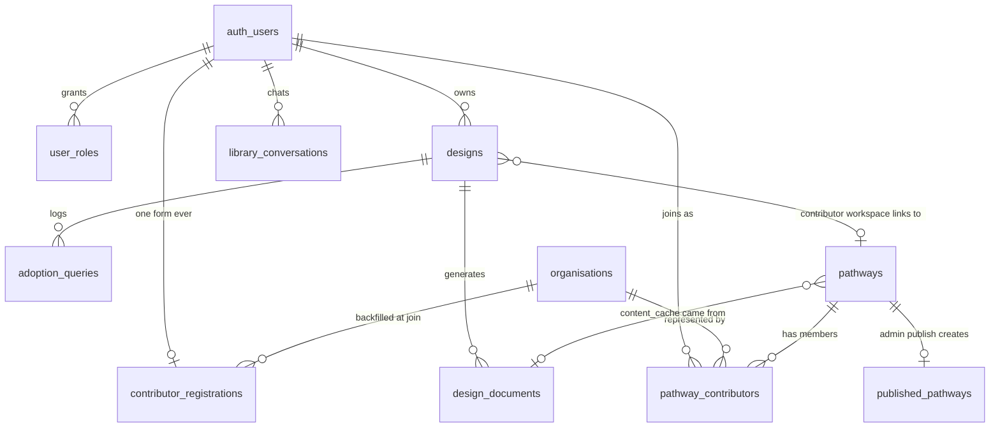

# Database

Postgres via Supabase, no ORM — raw `.from('table')` calls throughout `lib/` and `app/api/`. Schema of record: 32 sequential files under [`supabase/migrations/`](../../../supabase/migrations/). This page synthesizes the schema **after all 32 migrations are applied** — see [`../architecture/repository-conventions.md`](../architecture/repository-conventions.md) for migration-numbering convention.

## ERD

## Live tables

| Table | Key columns | Relationships | RLS |
|---|---|---|---|
| `designs` | `id`, `user_id`, `meta` jsonb, `grid_state` jsonb, `messages` jsonb, `pathway_id` | `user_id`→`auth.users` cascade; `pathway_id`→`pathways` set null | Owner-only full CRUD |
| `design_documents` | `id`, `design_id`, `user_id`, `doc_type` (`analysis`\|`plan`\|`draft`), `version_number`, `content_hash`, `content` | `design_id`→`designs` cascade | Owner select/insert |
| `user_roles` | `(user_id, role)` PK — `role` ∈ {`general_user`,`adopter`,`pathway_contributor`,`admin`} | `user_id`→`auth.users` cascade | Select-own only; all writes via service-role client |
| `adoption_queries` | `id`, `design_id`, `user_id`, `content`, `pathway_slugs[]` | `design_id`→`designs` cascade | Insert-own only — **no select policy for any client role** |
| `published_pathways` | `id`, `slug` unique, `title`, `description`, `category`, `content`, `sector`, `contributor_org`, `location`, `tags[]`, `stage`, `source_submission_id` (dangling/inert), `published_by`, `commit_message` | `published_by`→`auth.users` | **Public select (`using (true)`)**, writes service-role only |
| `contributor_registrations` | `id`, `user_id` unique, `organisation_name`, `pathway_role`, `pathway_description`, `poc_name`, `poc_email`, `public_links` (legacy name; holds org website), `org_id`, `access_status` (`pending`\|`approved`\|`rejected`), `declaration_accepted`, `mou_accepted`, `terms_accepted_at` (all three now set by the one Terms of Use checkbox on the registration form), `consent_name/logo/quote/blog` (no longer collected — left at default `false` since org attribution became mandatory under Terms §5.6), `share_name`, `share_contact`, `contact_info` | `user_id`→`auth.users` cascade; `org_id`→`organisations` set null | Owner select/insert; admin select-all. No user UPDATE policy — the sharing columns are changed via `POST /api/account/contact-sharing` (service-role, own row, those columns only) |
| `organisations` | `id`, `name` unique, `url` (set-once, never overwritten), `canonical_role` | none | Signed-in select; writes service-role only |
| `pathways` | `id`, `slug` unique, `title`, `sector`, `description`, `created_by`, `content_cache`, `review_requested`, `assembled_design_doc_id`, `published_design_doc_id` | `created_by`→`auth.users` set null; `*_design_doc_id`→`design_documents` | Signed-in select; **insert requires `pathway_contributor` role, enforced at the DB layer** via an `exists` policy |
| `pathway_contributors` | `id`, `pathway_id`, `user_id`, `org_id`, `role`, unique `(pathway_id,user_id)` | `pathway_id`→`pathways` cascade; `user_id`→`auth.users` cascade; `org_id`→`organisations` set null | Signed-in select-all; insert-own row only |
| `library_conversations` | `id`, `user_id`, `pathway_slug`, `pathway_title`, `messages` jsonb | `user_id`→`auth.users` cascade | Full owner CRUD |

## Inert tables (created, never read/written by current code)

| Table | Why it's inert |
|---|---|
| `pathway_cache` | Migration `0002`; an AI-output cache keyed by slug — no code references it |
| `wiki_cache` | Migration `0004`; a GitHub-raw fetch cache from before the corpus moved in-repo — no code references it |
| `pending_signups` | Migration `0005`; a pre-auth signup queue with an approval token — superseded by OTP self-serve signup; RLS enabled with zero policies |
| `contribution_units` | Migrations `0022`/`0025`; a fully-built, correctly-RLS'd table for individually tagged content atoms — nothing in current app code writes to it (the actual contributor-publish mechanism became a whole-document GitHub commit instead). See [`../knowledge/technical-debt.md#td-04`](../knowledge/technical-debt.md#td-04) |

## Dropped tables (still referenced by dead code)

`pathway_submissions`, `pathway_submission_versions`, `pathway_submission_exec_summaries` — all dropped in migration `0018_drop_retired_tables.sql`. Three route files and one `lib/` module still query them and would error (relation does not exist) if invoked. See [`../knowledge/technical-debt.md#td-01`](../knowledge/technical-debt.md#td-01).

## Notable column semantics

- **`designs.pathway_id` is contributor-only** — always `null` for an Explorer adoption, since an Explorer analyses their own project rather than contributing to a shared pathway workspace.
- **`pathways` and `published_pathways` are distinct.** `pathways` is the private, collaborative workspace; `published_pathways` is the public, live corpus row. Content crosses from one to the other only on admin publish.
- **`design_documents` is append-only, but only the latest row per `(design_id, doc_type)` is read back for `analysis`/`plan`** — a regeneration supersedes rather than branching. `draft` (pathway documents) is the one type where every version stays genuinely browsable, backing the version picker in `PathwayDocumentPane.tsx`.
- **`designs.document_review_turns_left` / `designs.typed_intro_turns_left`** (from migration `0001`) — confirmed dead columns; nothing reads or writes them today.

## Migration history (all 32, one line each)

| # | File | Purpose |
|---|---|---|
| 0001 | `designs.sql` | Base table: `meta`/`cube_state`/`messages` jsonb, owner-only RLS |
| 0002 | `pathway_cache.sql` | AI-output cache keyed by slug — now inert |
| 0003 | `design_documents.sql` | Versioned Analysis/Plan doc storage (`doc_type` originally `analysis`\|`plan` only) |
| 0004 | `wiki_cache.sql` | GitHub-raw fetch cache — now inert |
| 0005 | `pending_signups.sql` | Pre-auth signup queue — now inert |
| 0006 | `user_roles.sql` | `(user_id, role)`, roles constrained to `general_user`\|`adopter`\|`pathway_contributor` |
| 0007 | `admin_role.sql` | Widens role check to add `admin`; seeds two admins by email if already present |
| 0008 | `grid_revamp.sql` | **Destructive**: deletes old 7-dimension test rows; renames `cube_state`→`grid_state` |
| 0009 | `pathway_submissions.sql` | Contributor draft table — **dropped in 0018** |
| 0010 | `adoption_queries.sql` | Insert-only log of companion user messages |
| 0011 | `adoption_queries_pathway_tags.sql` | Adds `pathway_slugs text[]` |
| 0012 | `published_pathways.sql` | Public pathway store, RLS public-read; widens `pathway_submissions.status` |
| 0013 | `pathway_submission_versions.sql` | Version history + unique `(design_id)` upsert key — **dropped in 0018** |
| 0014 | `published_pathways_sector.sql` | Adds nullable `sector` |
| 0015 | `pathway_submission_exec_summaries.sql` | Internal-only exec summary table — **dropped in 0018** |
| 0016 | `contributor_registrations.sql` | One-time `/contribute` intake gate |
| 0017 | `published_pathways_contributor.sql` | Adds `contributor_org text` |
| 0018 | `drop_retired_tables.sql` | **Drops** the three `pathway_submission*` tables in FK-safe order |
| 0019 | `organisations.sql` | Org registry, unique `name` |
| 0020 | `pathways.sql` | Canonical pathway entity, `content_cache`, RLS-enforced insert role check |
| 0021 | `pathway_contributors.sql` | Join table |
| 0022 | `contribution_units.sql` | Individually tagged content atoms — never wired to app code |
| 0023 | `contributor_registrations_extend.sql` | `org_id` FK, `access_status`, sharing/consent fields |
| 0024 | `designs_pathway_fk.sql` | `designs.pathway_id`→`pathways`, set null |
| 0025 | `contribution_units_content.sql` | Adds `content`, drops `git_commit_sha` (abandons the per-contributor GitHub-draft-file plan) |
| 0026 | `schema_cleanup.sql` | Drops unused columns; renames `pathway_name`→`pathway_description`, `poc_role`→`pathway_role`, `org_role`→`role` |
| 0027 | `design_documents_draft_type.sql` | Widens `doc_type` check to add `draft` — **fixes a real bug**: every prior Contributor draft insert had been silently failing this constraint |
| 0028 | `pathways_description.sql` | Adds `pathways.description` |
| 0029 | `library_conversations.sql` | Saved `/explore` chats |
| 0030 | `published_pathways_explore_fields.sql` | Adds `location`, `tags[]`, `stage` |
| 0031 | `pathways_review_requested.sql` | Adds `pathways.review_requested` |
| 0032 | `pathways_design_doc_ids.sql` | Adds `assembled_design_doc_id`/`published_design_doc_id` FKs |

## Source files

`supabase/migrations/0001` through `0032`, `ARCHITECTURE.md` §4 (independently corroborates this synthesis).
