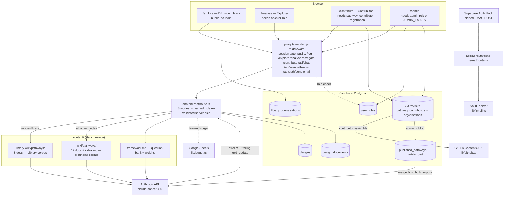
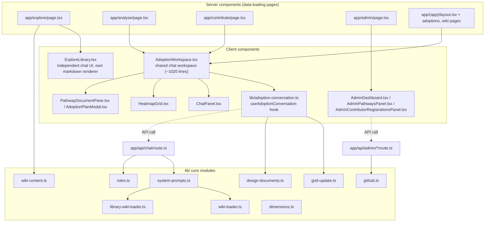
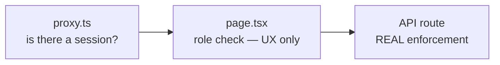

# Component Diagram

## System context

## Internal components (application layer)

**Notes on this diagram:**
- `AppShell.tsx` (Sidebar + content column) is the shared chrome for `/explore`, `/analyse`, `/contribute`, and the `(app)` route group — each builds its own instance rather than there being one central authenticated layout. `SiteHeader.tsx` survives only as the header on the "awaiting approval" screen in `app/(app)/layout.tsx`.
- `ExploreLibrary.tsx` deliberately does not reuse `ChatPanel.tsx` — it has its own markdown renderer, its own textarea, its own send button. This is a real duplication, not an oversight — the Library was ported verbatim from a separate standalone app (see [`knowledge/technical-debt.md`](../knowledge/technical-debt.md)).

## Three-deep enforcement (not a diagram duplicate — this is the access-control shape, cross-linked from business pages)

See [`business/users-and-personas.md`](../business/users-and-personas.md) for the full access-tier walkthrough this diagram supports.
