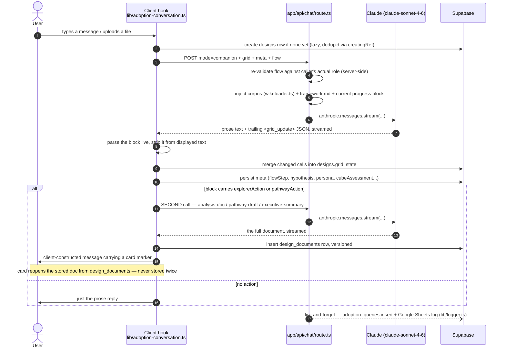
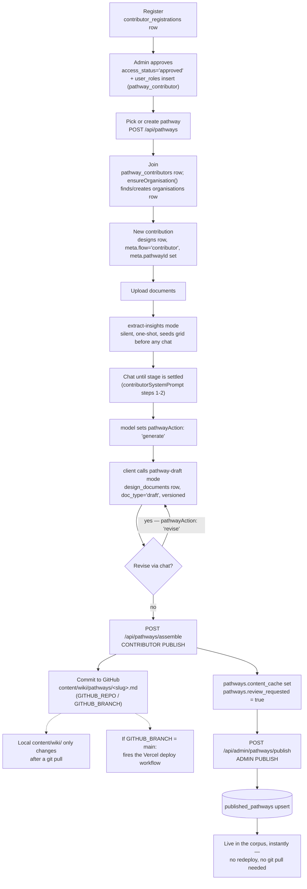
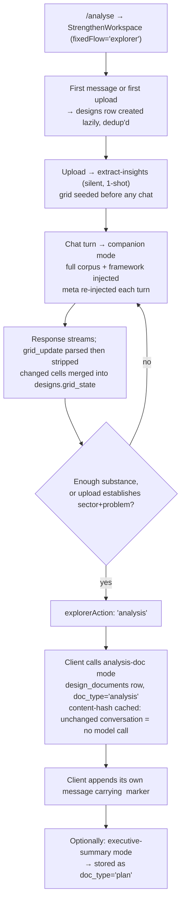

# Sequence & Workflow Diagrams

> Canonical file for both interaction sequences and business-workflow flowcharts. `business/workflows.md` links here rather than duplicating these diagrams.

## W1 — Companion chat turn (`mode: 'companion'`)

Referenced by [`business/workflows.md#w1`](../business/workflows.md#w1-companion-chat-turn).



## W2 — Contributor publishes a pathway (two-step: assemble → admin publish)

Referenced by [`business/workflows.md#w2`](../business/workflows.md#w2-contributor-publish).



**The gotcha (step `PUB1`):** the commit goes to the *remote* GitHub repo/branch, not the local working copy — `content/wiki/` on disk only changes after a `git pull`. If `GITHUB_BRANCH=main`, that commit itself fires `.github/workflows/deploy.yml`. Use a throwaway branch when testing this flow.

**Why two steps matter:** corpus loaders (`lib/wiki-loader.ts`, `lib/wiki-content.ts`) read `published_pathways`, which step `PUB1` never writes. Contributor publish alone puts nothing in front of any user — only admin publish (`PUB2`) does.

## W3 — Explorer produces an Analysis Document

Referenced by [`business/workflows.md#w3`](../business/workflows.md#w3-explorer-analysis-document).



Only the latest row per `(design_id, doc_type)` is ever read back for `analysis`/`plan` — a regeneration supersedes rather than branching a version the user must choose between. `draft` (pathway documents) is the one `doc_type` where every version stays browsable via the version picker in `PathwayDocumentPane.tsx`.

## The `<grid_update>` JSON contract (referenced by W1 and W3)

```json
{
  "cells": { "persona:Explore": { "density": 2, "note": "..." } },
  "meta":  { "name": "...", "sector": "...", "flowStep": 3, "hypothesis": "...", "persona": {"...": "..."}, "cubeAssessment": {"...": "..."} },
  "pathwaysReferenced": ["mahavistaar"],
  "flowStep": 3,
  "explorerAction": { "type": "analysis" },
  "pathwayAction":  { "type": "generate" }
}
```

Only one of `explorerAction` (Explorer/Analyse flow) or `pathwayAction` (Contributor flow) is ever present on a given contract, matching which system prompt built it (`lib/system-prompts.ts`). Full field reference: [`../integrations/ai-llm.md`](../integrations/ai-llm.md).
