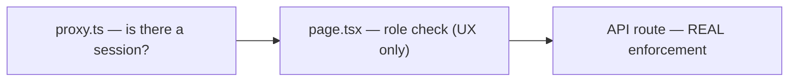

# Users and Personas

## Product personas (from framework/product intent)

- **Explorer (`adopter` role)** — someone analysing their own AI deployment against the corpus of documented pathways. Auto-granted on signup, so this is effectively every signed-in user by default.
- **Contributor (`pathway_contributor` role)** — someone with a real deployment write-up who wants it turned into a new corpus pathway. Requires an admin-approved registration in addition to the role.
- **Admin** — role/registration/pathway management. Granted via the `admin` role row or a permanent `ADMIN_EMAILS` environment allow-list.
- **Anonymous visitor** — no signup at all, full access to `/explore` (the public Diffusion Library) only.
- **General user (`general_user` role)** — exists in the `Role` type and the database check constraint, but no code path in the app currently branches on it distinctly from "signed in with no useful role."

## Operational roles inferred from code

| Role | Granted by | Gates |
|---|---|---|
| `adopter` | Auto-granted immediately after signup (`app/api/auth/grant-default-role/route.ts`) | `/analyse`, the Explorer branch of `/api/chat` |
| `pathway_contributor` | Admin only, via `POST /api/admin/contributor-registrations/approve` (which also flips the registration's `access_status`) or `POST /api/admin/roles` | `/contribute` (combined with a registration row), the Contributor branch of `/api/chat`, `POST /api/pathways`, `/api/pathways/[id]/join`, `/api/pathways/assemble`, `/api/pathways/check-similar` |
| `admin` | Admin role row **or** email match against `ADMIN_EMAILS` | `/admin`, every `app/api/admin/*` route |
| *(no role)* | Default state immediately after auth if `grant-default-role` failed | Redirected to `/explore`; sees an "awaiting approval" screen in the `(app)` route group |

## Access permissions

Enforcement is layered three deep, and only the last layer is the real gate:

- `proxy.ts` only checks for a signed-in session; it treats `/analyse` and `/contribute` as publicly reachable at the middleware layer, deliberately, so each page can render its own tiered anonymous/pending/wrong-role/approved view rather than being redirected away entirely.
- Every `app/api/chat/route.ts` companion-mode call **re-validates** `flow` against the caller's actual database role server-side, regardless of what the client sent — this is stated explicitly in the route's own logic, not just a convention.
- `app/api/pathways/route.ts` (POST) and its siblings enforce `pathway_contributor` at the database RLS layer too (an `exists (select ... from user_roles)` policy on `pathways` insert), not only in application code — one of the few places enforcement exists at both layers independently.

## Two independent gates on `/contribute` (contributor-specific)

1. A `contributor_registrations` row (organisation, point of contact, consents, MoU acceptance) — the one-time intake form.
2. The `pathway_contributor` role itself, granted by an admin.

Approving a registration (`app/api/admin/contributor-registrations/approve/route.ts`) does both in one action: it flips `access_status` to `approved` **and** upserts the `pathway_contributor` role — a contributor whose registration is approved does not need a second, separate role-grant step.

## Reconciliation with product vision

`CLAUDE.md` describes per-persona access as flowing from an explicit "intent" the Explorer picks from a four-card menu at the start of every session. That menu no longer exists in code — every `adopter` gets the same single 5-step `ANALYSE_FLOW` (`lib/explorer-intents.ts`), regardless of what job they came to do. The persona distinctions (initiative partner vs. funder vs. government official, etc., from `CLAUDE.md`'s `browse` intent) are not enforced or asked about anywhere in current code — they were product framing for the old menu, not a live access-control or personalization concept today.

## Planned vs. current Adopter/Contributor relationship

`docs/raw_documents/AI DIffusion Cube - Product Charter.docx` describes two persona-relevant capabilities not yet built, worth knowing before extending the role model:

- **"Adopter-to-Contributor Transition"** — the charter's stated intent is a *smooth* path where a user who starts out exploring or analysing can become a contributor over time, with the option to contribute surfaced "at the right moment" as their own adoption experience matures — explicitly **not** a hard switch between separate modes. Today's implementation is the opposite of smooth: the Explorer/Contributor choice is a one-time fork made by which entry point (`/analyse` vs `/contribute`) a user's *adoption* started from, permanently stored as `designs.meta.flow` and never revisited. A user can hold both `adopter` and `pathway_contributor` roles simultaneously today (nothing prevents it), but each individual adoption is locked to one flow for its lifetime — there is no in-conversation upgrade path.
- **Any user with an ongoing or planned adoption, "whether a new Adopter or an existing Contributor," can analyze it** — the charter's scope for "Analyze Own Adoption" does not gate this capability to the `adopter` role alone. In current code, `/analyse` and the companion's `flow==='explorer'` branch require the `adopter` role specifically (`lib/roles.ts`); a `pathway_contributor` who lacks `adopter` cannot use the Explorer analysis flow on their own adoption today. This is a real, verifiable gap between stated product scope and current role enforcement, not just an unbuilt nice-to-have.
- **Connecting with the contributors/adopters behind a pathway, with consent, where relevant** — named in the charter's "Analyze Own Adoption" scope. No such connection mechanism (consent capture, contact surfacing, messaging) exists anywhere in this codebase; `contributor_registrations.share_name`/`share_contact`/`contact_info` control what's shown *about* a pathway's contributor in principle, but nothing in current code actually surfaces that to another user in the product.

## Source files

`lib/roles.ts`, `proxy.ts`, `app/api/auth/grant-default-role/route.ts`, `app/api/admin/contributor-registrations/approve/route.ts`, `supabase/migrations/0016_contributor_registrations.sql`, `supabase/migrations/0023_contributor_registrations_extend.sql`, `lib/explorer-intents.ts`, `docs/raw_documents/AI DIffusion Cube - Product Charter.docx`.
