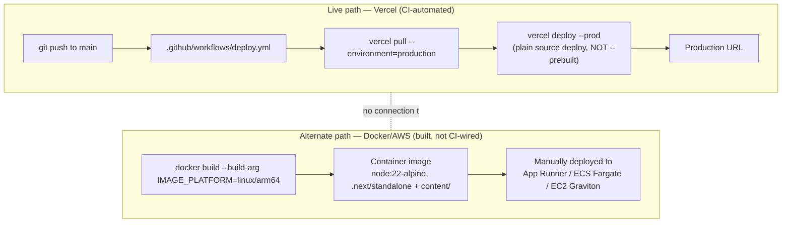

# Deployment

## Deployment topology



**These two paths are genuinely independent** — no GitHub Actions job builds or pushes the Docker image anywhere, and the Vercel workflow never touches the Dockerfile. Whichever one is actually serving production traffic at any given time is an operational fact this repository cannot answer on its own; both are real, buildable paths.

## The Vercel workflow, in detail

[`.github/workflows/deploy.yml`](../../../.github/workflows/deploy.yml) (43 lines):

- Triggers on push to `main`, or manual `workflow_dispatch`.
- Installs `vercel@latest`, runs `vercel pull --environment=production`, then `vercel deploy --prod` — a **plain source deploy**, not `vercel build` + `vercel deploy --prebuilt`.
- Authenticated via `VERCEL_TOKEN`/`VERCEL_ORG_ID`/`VERCEL_PROJECT_ID` GitHub Actions secrets.

**Why a plain source deploy, specifically** (documented in the workflow's own inline comment): Vercel's Hobby plan blocks deploys triggered by commits from a non-team-member author, with no way to add team members on that plan. A token-based deploy works around this — but Vercel's prebuilt/CI-flagged deploy path is *also* blocked under the same restriction even with a valid token, which is why this workflow deliberately uses the slower plain-source path instead of the normally-preferred build-then-deploy split.

## The Docker/AWS path, in detail

See [`infrastructure.md`](infrastructure.md#docker--aws-path) for the Dockerfile's structure. To build and run locally:

```bash
docker build --build-arg IMAGE_PLATFORM=linux/arm64 \
  --build-arg NEXT_PUBLIC_SUPABASE_URL=... \
  --build-arg NEXT_PUBLIC_SUPABASE_ANON_KEY=... \
  -t diffusion-cube .
docker run -p 3000:3000 --env-file .env.production diffusion-cube
```

Remember: `NEXT_PUBLIC_*` values must be passed as `--build-arg`, not just in the `--env-file` at run time — see the Dockerfile's own header comment and [`../architecture/configuration.md`](../architecture/configuration.md#build-time-vs-runtime-variables).

> **Note:** No automated deployment pipeline exists for the Docker/AWS path in this repository — it is built and deployed manually using the steps documented here and in the Dockerfile's own comments. There is no rollback tooling, blue/green deploy script, or health-check gate defined in-repo for this path.

## Operational dependency risk (from the Product Charter)

> **Note:** This is a time-sensitive operational fact, not a code finding — recorded here because nothing else in the repository would surface it. Per `docs/raw_documents/AI DIffusion Cube - Product Charter.docx`'s "Dependencies" section (Execution Approach, §4):
>
> - **Anthropic/Claude API access** is currently a **free account expiring 28-Oct-2026**. The charter states a new account/license needs to be planned for *before* that date. Given every AI-backed feature in this app (`app/api/chat/route.ts`, `app/api/pathways/check-similar/route.ts` — see [`ai-llm.md`](../integrations/ai-llm.md)) depends on `ANTHROPIC_API_KEY` resolving to a working Anthropic account, this is the single most urgent item in this entire wiki as of the date this page was written (2026-09-28) — under a month of runway.
> - **AWS account** is currently a **free account expiring December 2026**. The charter states a new account needs to be planned for by November 2026 to allow time to migrate. This affects the Docker/AWS deployment path described above (currently "prepared groundwork," per the Product Charter's own "Deployment in AWS environment" requirement status of "Not started" — see [`../business/business-overview.md#roadmap-planned-not-yet-implemented`](../business/business-overview.md#roadmap-planned-not-yet-implemented)), not the live Vercel path.
>
> Neither expiry date nor its resolution is tracked anywhere in application code or CI config — this note exists only because the Product Charter recorded it. Re-verify both dates directly with whoever holds the Anthropic and AWS account relationships before relying on this note past its own currency.

## Contributor-publish deploy side effect (worth knowing before testing)

`POST /api/pathways/assemble` commits directly to the GitHub repo/branch named by `GITHUB_REPO`/`GITHUB_BRANCH`. **If `GITHUB_BRANCH` is set to `main`, that commit fires the Vercel deploy workflow above** — a contributor publishing a pathway draft would trigger a production deploy as a side effect. Use a throwaway branch (the default is `pathways-dev`) when testing this flow in a non-production environment. See [`../business/workflows.md#w2`](../business/workflows.md#w2--contributor-publish).

## Source files

`.github/workflows/deploy.yml`, `Dockerfile`, `.dockerignore`, `next.config.ts`, `lib/github.ts`, `docs/raw_documents/AI DIffusion Cube - Product Charter.docx`.
